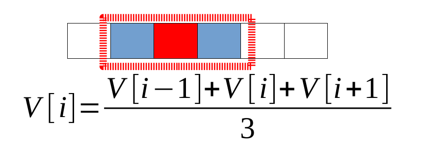
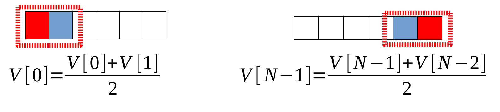
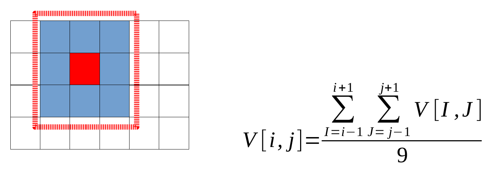
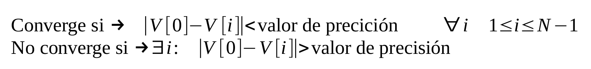

# Problema de Reducción 

Se aplica la función promedio hasta alcanzar un valor aproximado de convergencia.  
Se resolvera en una y dos dimensiones.

---

## Caso 1: Una dimension

Se parte de un arreglo V de N elementos de tipo float.  
Para cada elemento en la posición i del vector V debe calcularse el 
promedio entre el valor actual y sus vecinos próximos.  

  

Los casos especiales del primer y último elemento deben calcularse de la siguiente manera:

  

---

## Caso 2: Dos dimensiones

Se parte de una matriz V de NxN elementos de tipo float.
Para cada elemento en la posición (i,j) de la matriz V debe calcularse el promedio entre el valor actual y sus vecinos próximos, esto es:

  

Los casos especiales son las esquinas y los laterales de la matriz. En estos casos, se debe seguir la misma estrategia que en una dimensión: considerar sólo los vecinos próximos existentes y dividir por la cantidad de valores utilizados (esquinas dividir por 4 y laterales dividir por 6).

---

## Pautas de Convergencia

Una vez realizada una reducción, se debe verificar que todos los valores del vector convergen a un valor similar.  
Para verificar la convergencia se toma el primer elemento y se
compara con el resto de los elementos del vector. Si la diferencia en valor absoluto del valor del primer elemento con todos los elementos restantes es menor a un valor de precisión el algoritmo converge, en caso contrario el algoritmo no converge:

  

Para el caso de dos dimensiones se toma el primer elemento V[0,0].

Si los valores convergen el algoritmo finaliza si los valores no convergen debe aplicarse la reducción nuevamente. Esto puede implicar varias ejecuciones de la reducción hasta que los
valores convergen.

