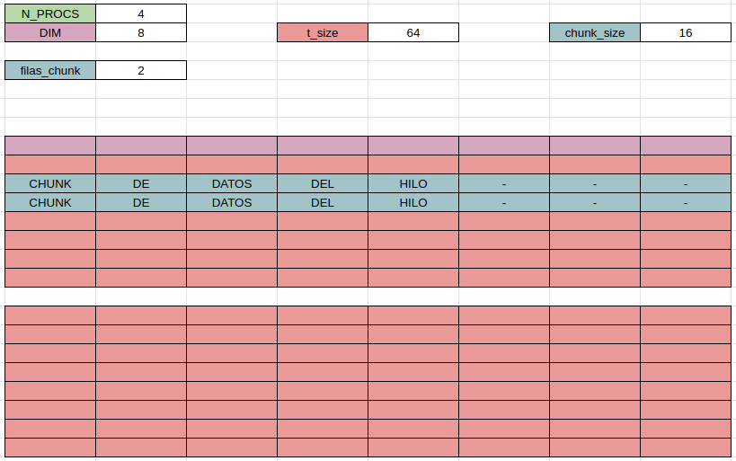
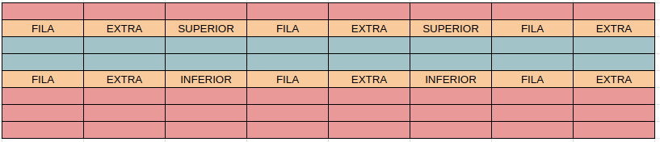
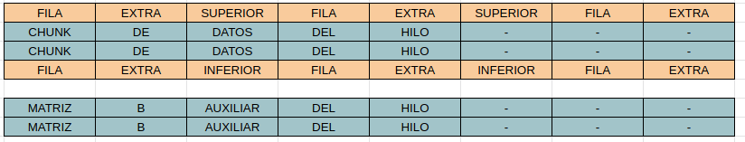

# Resolucion utilizando Memoria Distribuida - MPI

El archivo `mpiUnaDimensionReduccion.c` contiene la resolucion realizando:
* Pasaje del Vector A a todos los hilos.
* Pasaje de B[0] a todos los hilos.
* Cada hilo calcula su propia convergencia y le envia al padre la misma.
* El Padre verifica la convergencia de todos los hilos y avisa si deben seguir reduciendo el vector.

Modo de compilacion
```
    mpicc -o output input.c
```

Uso
```
    mpirun -np NUM_PROCESOS output DIM
```

---

## Modelo de Resolucion

Se utiliza para el root una matriz A de DIM * DIM con los valores originales, y una matrix B de DIM * DIM como auxiliar.

El hilo root (ID == 0) se encargara del primer chunk de datos de la matriz y repartira el resto. <br>
Un chunk de datos esta dado por chunk_size = (DIM * DIM) / N_PROCS. <br>
Por ende, las filas que le corresponde iterar a cada hijo es chunk_size / DIM <br>
Esto es posible ya que la matriz esta ordenada por filas. <br>

  


El problema surge al querer calcular la reduccion del chunk_size que le corresponde a cada hijo. <br>
Este deberia tener acceso a Chunk_size, la fila superior y la fila inferior del chunk. <br>
Para esto, se envia el chunk_size + (2 * DIM), es decir las filas correspondientes para calcular. <br>

  

No obstante, la matriz B auxiliar permanece de size chunk_size sin tener estas filas extra. Por ende, al acceder a la fila i de la matriz A, se guarda la reduccion en la fila (i - 1) de la matriz B. <br>

Entonces, el proceso hijo ve 2 matrices de size chunk_size y de size chunk_size + (2 * DIM). <br>

Para acceder a la parte que tiene que calcular de A debe iterar desde i = 1, ya que i = 0 corresponde a la fila extra. <br>
En otras palabras, la parte que le corresponde a un hilo hijo para la matriz A va desde i = 1 hasta i = (chunk_size / DIM) + 1. <br>
La parte que le corresponde de B es simplemente de i = 0 hasta i = (chunk_size / DIM). <br>
Por ende, el calculo del dato que guardamos en `B[i * DIM + j]` corresponde a `A[(i + 1) * DIM + j]`. <br>
Por simplicidad a la hora de iterar, cambiamos esta relacion y comenzamos desde i = 1, para que sea `B[(i - 1) * DIM + j]` correspondiente a `A[i * DIM + j]`. <br>

  


Por ende, se debera iterar de la siguiente forma:
```c
filas_chunk = slaveSize / DIM;
for (i = 1; i < filas_chunk + 1; i++){
    for (j = 0; j < DIM; j++){
        B[(i - 1) * DIM + j] = //Operacion de reduccion sobre A[i * DIM + j];
    }
}
```